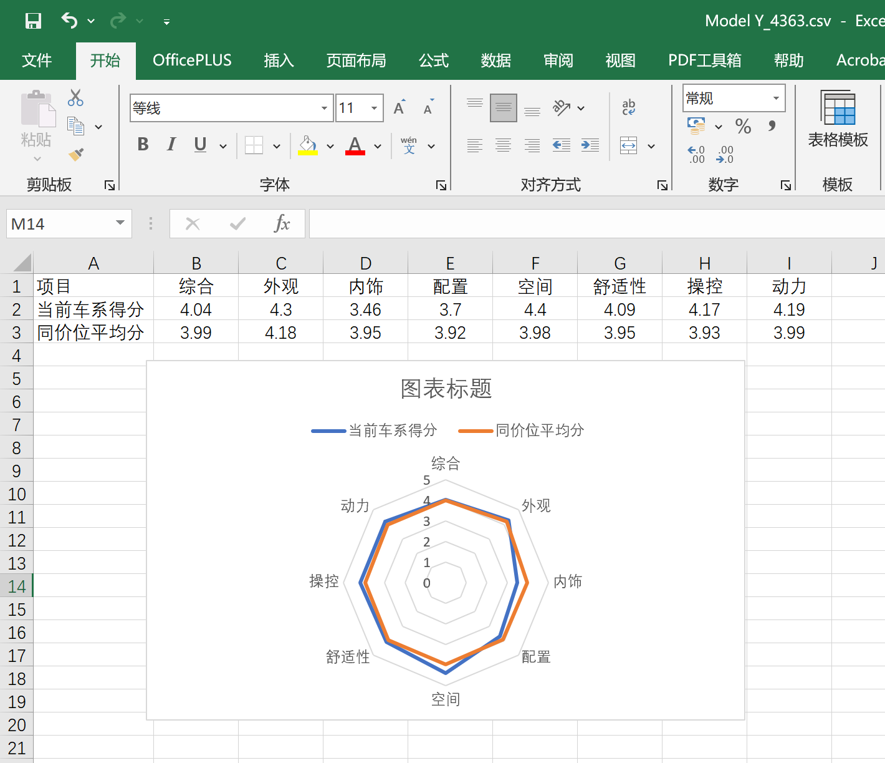

# 懂车帝汽车排行榜信息爬取
## 介绍
本项目是一个基于`Python+Selenium+Reqeusts+BeautifulSoup`的汽车排行榜信息爬取项目，旨在从懂车帝网站 https://www.dongchedi.com  爬取销量榜、麋鹿测试榜、加速榜和制动榜汽车信息。
1. 爬取**汽车排行榜信息**，并将这些数据分别保存为`CSV`文件
2. 爬取`CSV`文件中车辆的**详细参数信息**，并将这些数据保存为`CSV`文件

- **销量榜**

- **麋鹿测试榜**

- **加速榜**

- **制动榜**

- **详细参数**


## 运行环境
本项目依赖以下Python库：
- `requests`
- `selenium`
- `bs4`
- `pandas`
- `numpy`
- `matplotlib`

**注意：请确保安装了Chrome浏览器和对应版本的ChromeDriver，并将ChromeDriver的路径添加到系统环境变量中，[安装方法](https://blog.csdn.net/Z_Lisa/article/details/133307151)。**

## 代码结构
```
懂车帝汽车信息爬取项目/
│
├── sale.csv - 存储从懂车帝网站爬取的销量排行榜信息。
├── elk_test.csv - 存储从懂车帝网站爬取的麋鹿测试排行榜信息。
├── accelerate.csv - 存储从懂车帝网站爬取的汽车模型信息。
├── brake.csv - 存储从懂车帝网站爬取的汽车模型信息。
│
├── 参数/ - 该目录下包含所有下载的汽车的参数信息。
│   ├── {销量排行榜}/
│   │   ├── {汽车名称}_{汽车ID}.csv
│   │   └── ...
│   ├── {麋鹿测试排行榜}/
│   │   ├── {汽车名称}_{汽车ID}.csv
│   │   └── ...
│   ├── {加速排行榜}/
│   │   ├── {汽车名称}_{汽车ID}.csv
│   │   └── ...
│   ├── {制动排行榜}/
│   │   ├── {汽车名称}_{汽车ID}.csv
│   │   └── ...
├── 得分/ - 该目录下包含所有下载的汽车的评分信息。
│   ├── {销量排行榜}/
│   │   ├── {汽车名称}_{汽车ID}.csv
│   │   └── ...
│   ├── {麋鹿测试排行榜}/
│   │   ├── {汽车名称}_{汽车ID}.csv
│   │   └── ...
│   ├── {加速排行榜}/
│   │   ├── {汽车名称}_{汽车ID}.csv
│   │   └── ...
│   ├── {制动排行榜}/
│   │   ├── {汽车名称}_{汽车ID}.csv
│   │   └── ...
|
└── request_crawler.py - 使用requests和BeautifulSoup爬取汽车参数和评分的脚本。
└── selenuim_crawler.py - 使用Selenium和BeautifulSoup爬取汽车参数和评分的脚本。
```

## 使用方法
### 1. 爬取排行榜信息
```python
from selenuim_crawler import DongciediCrawler

# 1. 实例化爬虫对象
dongchedi_crawler = DongCheDiCrawler()

# 2. sale_url为销量排行榜的URL
sale_url = 'https://www.dongchedi.com/sales/sale-x-x-x-x-x-x'

# 3. 爬取销量排行榜信息
dongchedi_crawler.sale_parser(
    csv_name='sale.csv',
    url=sale_url
)
```
### 2. 爬取汽车参数信息
```python
from selenuim_crawler import DongciediCrawler

# 1. 实例化爬虫对象
dongchedi_crawler = DongCheDiCrawler()

# 2. params_url为汽车参数的URL
params_url = 'https://www.dongchedi.com/auto/params-carIds-x-4363'

# 3. 爬取汽车参数信息
dongchedi_crawler.params_parser(
    csv_name='params.csv',
    url=params_url
)
```

### 3. 爬取汽车得分信息
```python
from selenuim_crawler import DongciediCrawler

# 1. 实例化爬虫对象
dongchedi_crawler = DongCheDiCrawler()

# 2. score_url为汽车评分的URL
score_url = 'https://www.dongchedi.com/auto/series/score/4363'

# 3. 爬取汽车得分信息
dongchedi_crawler.get_score(
    csv_name='scores.csv',
    url=score_url
)
```
## 运行结果
- **销量排行榜信息**

- **参数信息**

- **评分信息**

## 注意事项
- 请在合法范围内使用此爬虫项目，遵守《懂车帝》网站的爬虫政策和相关法律法规。
- 为避免给目标网站服务器带来不必要的负担，建议在爬取数据时适当增加等待时间。